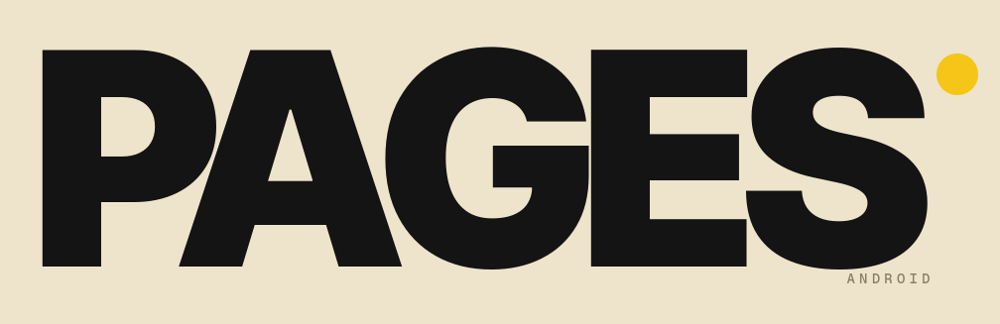
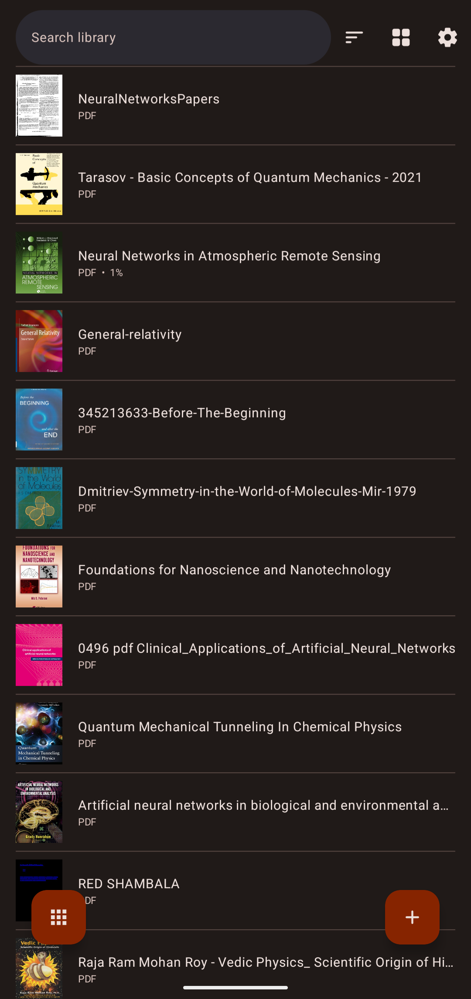
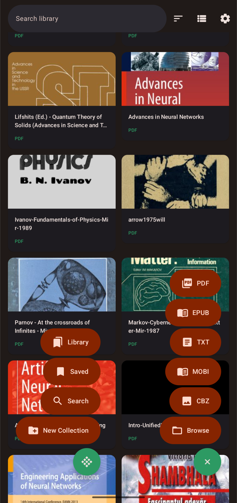
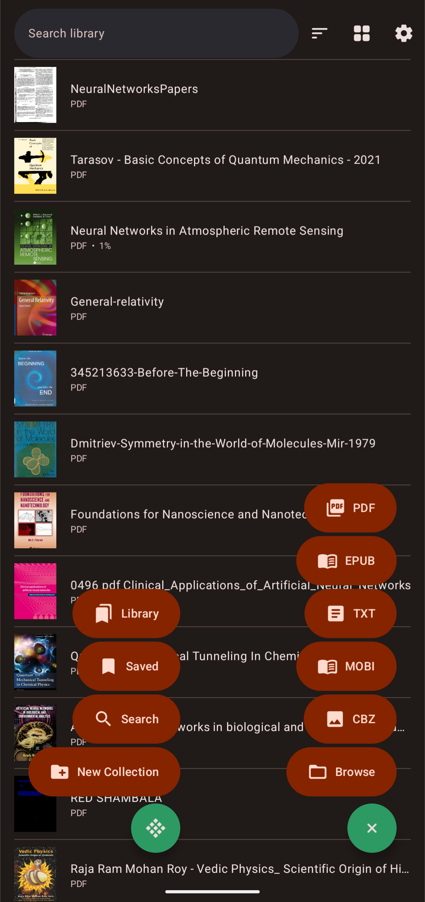
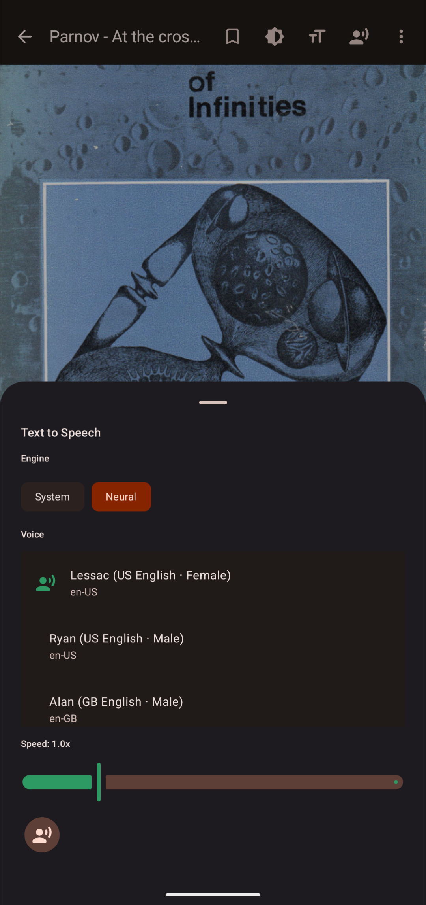
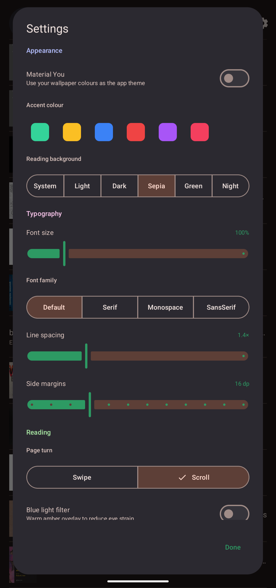
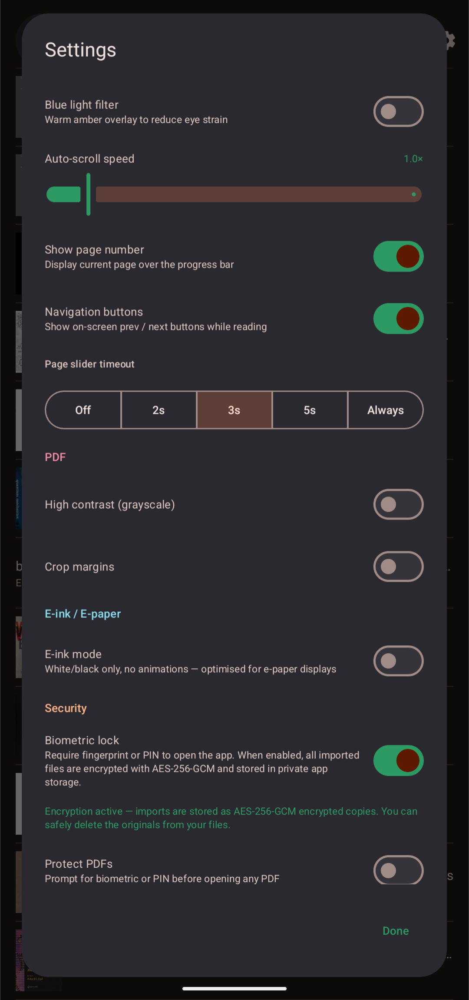
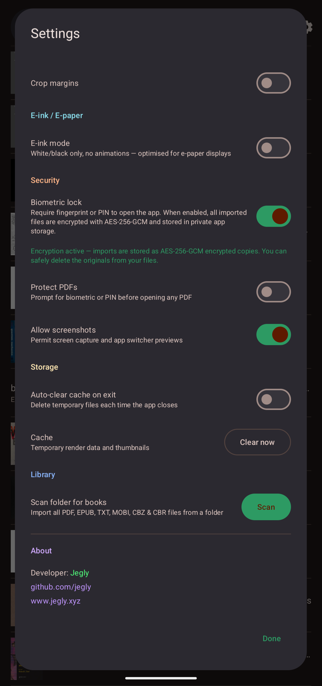

<p align="center">
  
</p>

**A beautiful, privacy-first ebook reader for Android — PDF, EPUB, MOBI, TXT, CBZ & CBR**

[](https://kotlinlang.org) [](https://developer.android.com) [](https://github.com/jegly/pages/releases) [](LICENSE) [](https://developer.android.com/jetpack/compose)

[](https://github.com/jegly/pages/releases/latest)

[](https://www.buymeacoffee.com/jegly)

If this project helped you, please ⭐️ star it. **Also try [OfflineLLM](https://github.com/jegly/OfflineLLM)** and **[Box](https://github.com/jegly/Box)** — on-device AI apps built on the same privacy-first philosophy.

---

**📱 Screenshots**

<table>
  <tr>
    <td></td>
    <td></td>
    <td></td>
  </tr>
  <tr>
    <td></td>
    <td></td>
    <td></td>
  </tr>
  <tr>
    <td></td>
    <td></td>
    <td></td>
  </tr>
</table>

---

## Features

- **Six formats** — PDF, EPUB, MOBI, TXT, CBZ & CBR all read natively
- **Beautiful reader** — swipe or scroll page turn, pinch-to-zoom, fullscreen mode, progress slider with configurable timeout, go-to-page, on-screen nav buttons
- **PDF tools** — fit page / fill width / fill screen modes, margin crop, high contrast (grayscale)
- **Text customisation** — font size (70–250%), font family, line spacing, side margins, 6 reading backgrounds (System / Light / Dark / Sepia / Green / Night), brightness control, blue light filter
- **Neural TTS** — fully offline text-to-speech via Sherpa-ONNX with 4 bundled Piper voices (Lessac, Ryan, Alan, Amy); sentence-level highlight while reading; auto-advances pages; speed & pitch control
- **Table of Contents** — chapter navigation for EPUB
- **In-book search** — full-text search across EPUB, MOBI & TXT
- **Highlights & bookmarks** — highlight text in four colours, bookmark any page
- **Auto-scroll** — hands-free reading at adjustable speed
- **Foldable support** — dual-page spread and tabletop modes for foldable devices
- **E-ink mode** — white/black only, no animations, optimised for e-paper displays
- **Material You** — dynamic colour from your wallpaper, or choose from 6 accent colours
- **Collections** — organise your library into groups
- **Folder scan** — import an entire folder of books in one tap
- **No READ_EXTERNAL_STORAGE** — file access via Storage Access Framework only

## Security

- **Encrypted files** — imported books stored as AES-256-GCM encrypted copies in private app storage when biometric lock is enabled; originals can be safely deleted
- **Encrypted database** — SQLCipher AES-256 for all metadata, bookmarks and highlights
- **Biometric lock** — fingerprint or PIN required to open the app
- **PDF auth gate** — require biometric or PIN before opening any PDF
- **Inactivity lock** — auto-locks after 5 minutes of inactivity
- **Screenshot protection** — `FLAG_SECURE` blocks screen capture and app-switcher previews
- **`allowBackup=false`** — no cloud backup of your library or encrypted files
- **Privacy Sandbox blocked** — all ad/tracking services explicitly denied in the manifest
- **Auto-clear cache** — delete temporary render data on every app close

## Install

1. Download the APK from [Releases](https://github.com/jegly/pages/releases/latest)
2. **Settings → Apps → Install unknown apps** → allow your file manager
3. Open the APK and tap Install

Requires Android 14+.

## Build from Source

```
git clone https://github.com/jegly/pages.git
cd pages
./gradlew assembleRelease
```

**Prerequisites:** JDK 17, Android SDK (compileSdk 35)

## License

Apache License 2.0

---

**[www.jegly.xyz](https://www.jegly.xyz)**
